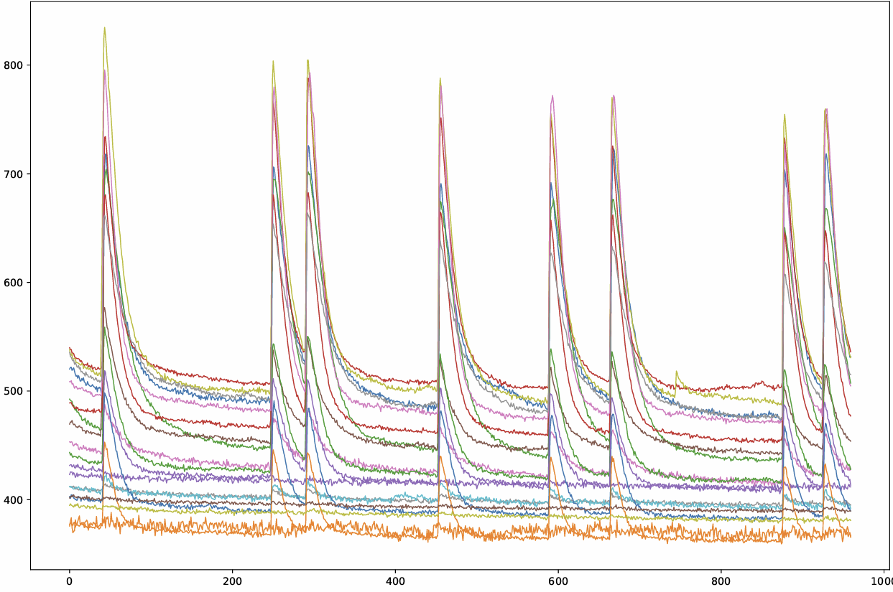
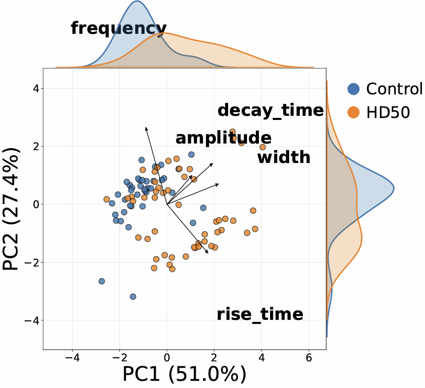
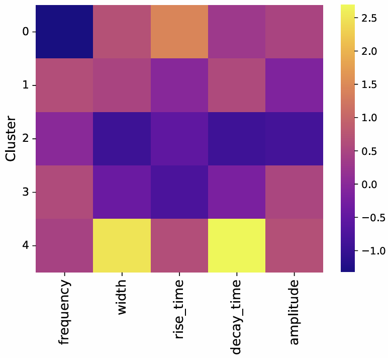
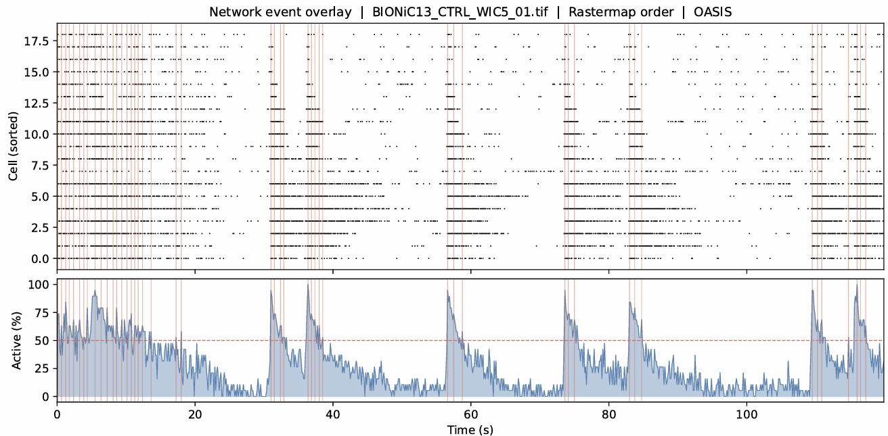
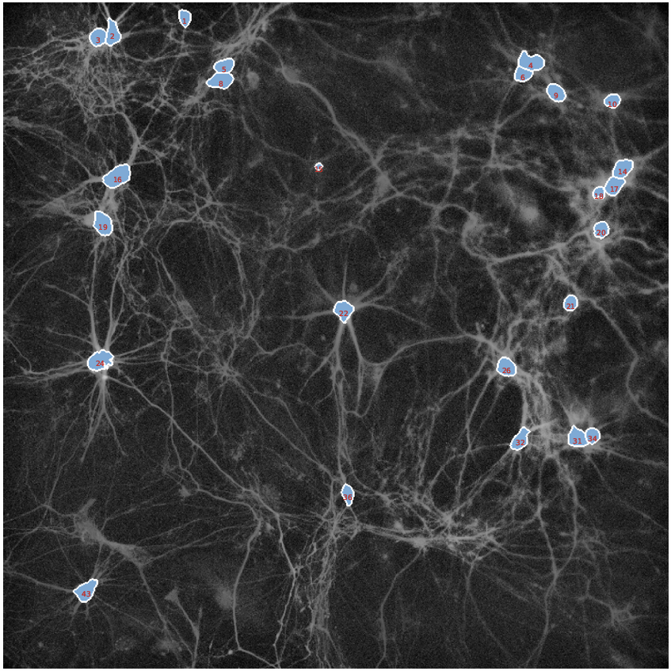

# Analysis outputs & extracted features

LUMIN extracts quantitative features at both the single-cell and network level from calcium imaging recordings. These outputs can be used for downstream statistics, clustering, phenotyping, and condition comparisons.

---

## Output overview

| Analysis step | Main outputs |
|---|---|
| Segmentation | ROI masks, fluorescence traces |
| Event detection | ΔF/F traces, detected calcium events |
| Spike inference | Inferred spike trains |
| Single-cell analysis | Frequency, amplitude, rise/decay metrics |
| Network analysis | Synchrony, bursts, participation metrics |

---

## Single-cell features

The following features are extracted per cell:

| Feature | Description |
|---|---|
| Event frequency | Number of detected events over time |
| Peak amplitude | Maximum ΔF/F intensity per event |
| Event width | Duration of detected events |
| Rise time | Time from onset to peak |
| Decay time | Time from peak back to baseline |
| Area under curve (AUC) | Integrated fluorescence response |
| Active/inactive classification | Activity-based cell classification |

These features are stored in `.csv` and `.pkl` tables for downstream analysis.

---

### Example: fluorescence traces and detected events

Add an example showing:
- Raw fluorescence traces
- ΔF/F normalization
- Detected calcium events

```markdown

```

---

## Population and clustering analysis

LUMIN automatically performs downstream comparisons across cells and conditions.

### Included analyses

* K-means clustering
* Principal component analysis (PCA)
* Condition comparisons
* Replicate-level summaries

---

### Example: PCA and clustering

Add example figures such as:

* PCA embeddings
* Cluster heatmaps
* Beeswarm plots

```markdown



```

---

## Network-level features

When spike inference is enabled, additional network metrics are computed.

| Feature              | Description                          |
| -------------------- | ------------------------------------ |
| Population bursts    | Coordinated activity across cells    |
| Synchrony            | Degree of simultaneous activity      |
| Participation score  | Fraction of cells involved in events |
| Burst frequency      | Number of network events over time   |
| Inter-event interval | Time between network bursts          |

---

### Example: network activity

Add representative outputs such as:

* Raster plots
* Synchrony heatmaps
* Population burst visualisations

```markdown



```

---

## Visual outputs

LUMIN automatically generates publication-ready visualisations, including:

* ROI overlays
* Fluorescence trace plots
* Event detection overlays
* Heatmaps
* PCA plots
* Cluster visualisations
* Raster plots
* Network activity summaries

---

### Example: segmentation overlays

Add examples of:

* Automated segmentation
* Hybrid refinement
* Final ROI masks

```markdown

```

---

## Notes

* All outputs are generated per experiment and organised automatically
* Intermediate outputs remain accessible for validation and re-analysis
* Both `.csv` and `.pkl` formats are provided for compatibility with Python and spreadsheet software
* Feature extraction depends on segmentation quality and event detection parameters
