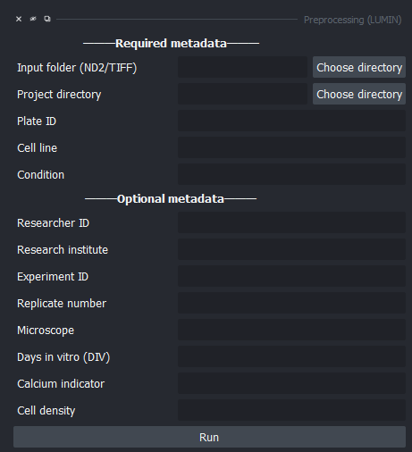
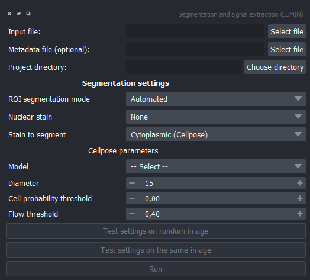
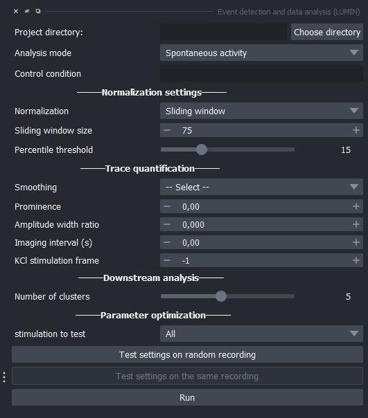
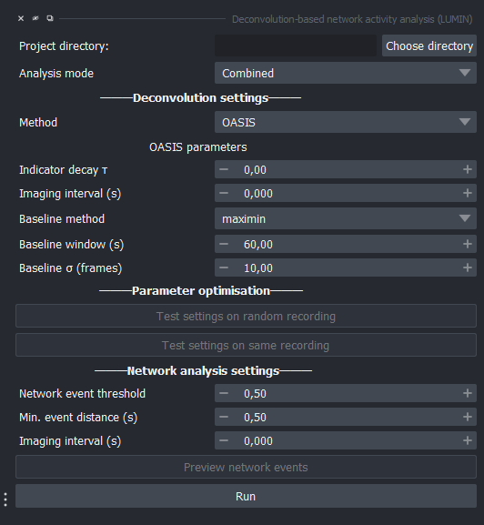

# Workflow Overview

This pipeline provides an end-to-end workflow for calcium imaging analysis, from raw recordings to single-cell and network-level insights. Each step generates structured outputs, allowing inspection and flexible re-analysis.

```text
Input → Segmentation + signal extraction → Activity detection → Features
```

---

## Pipeline overview

| Step | Input | Output |
|------|------|--------|
| **1. Input** | ND2 / TIFF recordings + metadata | Structured input file(`_input.csv`) |
| **2. Segmentation & signal extraction** | input file + recordings folder (`.tiff`) | ROI masks + fluorescence traces (`cell_properties_signal_extraction.pkl`) |
| **3. Event detection** | Fluorescence traces | Detected events + single-cell activity metrics |
| **4. Spike inference** | Fluorescence traces | Inferred activity + network activity metrics|

!!! tip
    You can inspect results after each step before continuing the pipeline.

---

## Pipeline steps

### 1. Input

**Input:**

- Calcium imaging recordings (`.nd2` or `.tiff`)
- Metadata (plate ID, cell line, condition, etc.)

**Output:**

- Structured `_input.csv`
- Organised project directory with converted `.tiff` files (if needed)


---

### 2. Segmentation & signal extraction

Cells are detected and fluorescence signals are extracted per ROI.

**Modes:**

- Automated — ROI detection using Cellpose  
- Hybrid — automated detection with manual ROI refinement  
- Manual — user-defined ROI selection  

**Input:**

- `_input.csv`
- Folder with recordings

**Output:**

- ROI masks (`.tiff`)
- Fluorescence traces per cell
- Cell properties table (`.csv` / `.pkl`)


---

### 3. Event detection (ΔF/F)

Fluorescence traces are normalised and analysed for activity.

**Input:**

- Fluorescence traces (`cell_properties_signal_extraction.pkl`)

**Processing:**

- ΔF/F normalisation
- Peak detection

**Output:**

- Detected calcium events per cell
- Single-cell activity metrics


---

### 4. Spike inference

Fluorescence traces are deconvolved and action potentials are being estimated.

**Input:**

- Fluorescence traces (`cell_properties_signal_extraction.pkl`)

**Processing:**

- Deconvolution using OASIS

**Output:**

- Inferred spike trains
- Network activity metrics


---


## Key features

- Scalable across datasets and experiments 
- Modular workflow — run steps independently   
- Intermediate outputs for validation  
- Model-based spike inference (OASIS)  


## Getting started

See the [Installation](installation.md) page to get started.
